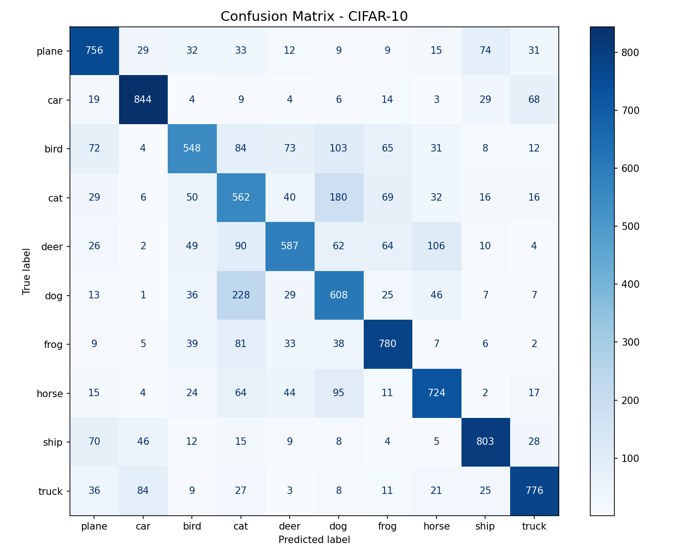
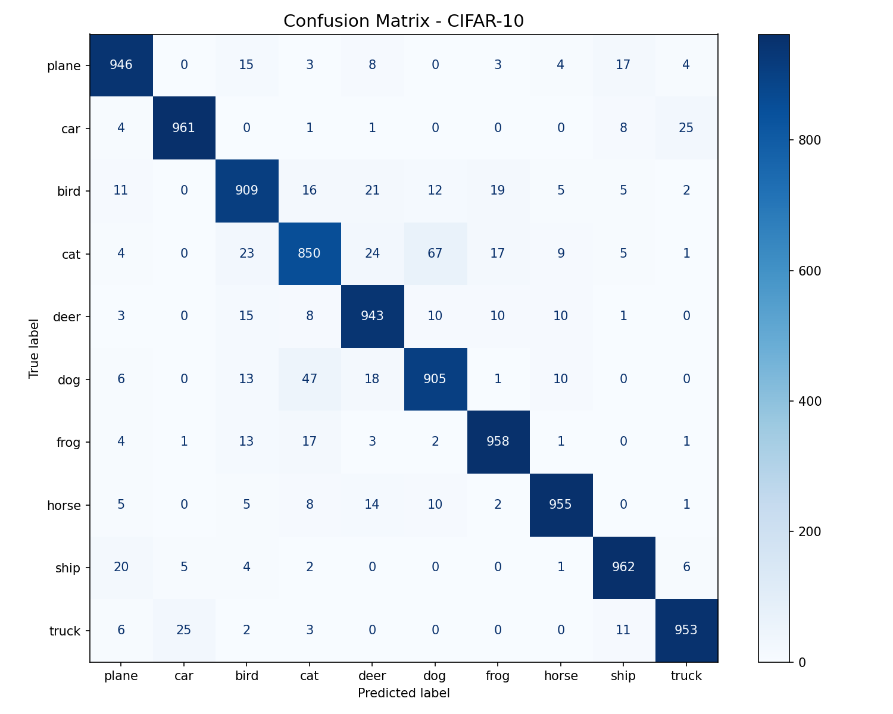

# CIFAR-10 Image Classification — A Learning Journey

A step-by-step CNN image classification project on CIFAR-10, built from scratch as part of learning deep learning fundamentals. The project evolves through four stages, each introducing new techniques to push accuracy higher.

## Results Summary

| Model | Params | Epochs | Test Accuracy |
|---|---|---|---|
| v1 — Basic CNN | 62K | 20 | ~70% |
| v2 — Dropout + BatchNorm | 2.2M | 30 | 84.9% |
| v3 — Custom ResNet | 3.5M | 40 | **93.4%** |
| v4 — Transfer Learning (ResNet18) | 11.2M | 15 | 92.9% |

## What I Learned

This project covers the full deep learning workflow:

- **Data pipeline**: normalization, data augmentation (random flip, random crop), DataLoader with batching and shuffling
- **Model architecture**: Conv2d, MaxPool2d, ReLU, BatchNorm, Dropout, Flatten, Linear
- **Training loop**: forward pass, CrossEntropyLoss, backpropagation, SGD with momentum and weight decay
- **Learning rate scheduling**: StepLR (stage-wise decay) and CosineAnnealingLR (smooth decay)
- **Residual connections**: custom ResidualBlock with skip connections to solve vanishing gradients
- **Transfer learning**: loading pretrained ResNet18, freezing layers, two-stage fine-tuning
- **Evaluation**: confusion matrix, ROC curves, per-class AUC, classification report

## Project Structure

```
cifar10-cnn-journey/
├── train.py             # v1: basic two-layer CNN
├── train_v2.py          # v2: adds Dropout + BatchNorm + wider channels
├── train_resnet.py      # v3: custom ResNet with residual blocks
├── train_transfer.py    # v4: transfer learning with pretrained ResNet18
├── evaluate.py          # confusion matrix + ROC curve visualization
├── results/             # saved plots from each experiment
│   ├── confusion_matrix_v1.png
│   ├── confusion_matrix_v2.png
│   ├── confusion_matrix_resnet.png
│   ├── roc_curve_v2.png
│   └── roc_curve_resnet.png
├── requirements.txt
└── .gitignore
```

## Confusion Matrix Progression

The confusion matrices below show how the model's weaknesses evolved across versions. Cat vs. dog remained the hardest pair throughout — even the ResNet version only reaches ~85% on cat, reflecting the genuine difficulty of distinguishing the two in 32×32 images.

| v1 (~70%) | v2 (84.9%) | ResNet (93.4%) |
|---|---|---|
|  |  |  |

## Quickstart

### 1. Clone and set up environment

```bash
git clone https://github.com/<your-username>/cifar10-cnn-journey.git
cd cifar10-cnn-journey

python3 -m venv env_cnn
source env_cnn/bin/activate
pip install -r requirements.txt
```

### 2. Download CIFAR-10

The dataset is not included in this repo. It will be downloaded automatically on first run, or you can trigger it manually:

```python
import torchvision
torchvision.datasets.CIFAR10(root='./data', train=True, download=True)
```

### 3. Train a model

```bash
# Basic CNN
python train.py

# With Dropout + BatchNorm
python train_v2.py

# Custom ResNet
python train_resnet.py

# Transfer learning (downloads pretrained ResNet18 weights automatically)
python train_transfer.py
```

### 4. Evaluate

```bash
python evaluate.py
# Saves confusion matrix and ROC curve to ./logs/
```

## Environment

- Python 3.10+
- PyTorch 2.x
- Ubuntu 24 (tested), should work on any Linux/macOS

Training times (CPU unless noted):
- v1/v2: ~30–60 min on CPU
- ResNet: ~60–90 min on CPU, ~15 min on GPU
- Transfer: ~60 min on CPU, ~20 min on GPU (downloads ~45MB pretrained weights)

## Key Observations

**Why does cat always score lowest?** At 32×32 resolution, cats and dogs share nearly identical low-level features — rounded heads, similar fur texture, four-limbed silhouettes. The model needs high-level semantic understanding to tell them apart, which requires either a deeper architecture or higher resolution input.

**Why is transfer learning so fast?** In Stage 1 (only the classification head is trained), we reach 80% accuracy in 5 epochs. This is because ResNet18's convolutional layers — pretrained on 1.2M ImageNet images — already encode rich general-purpose visual features that transfer directly to CIFAR-10.

**Why does our custom ResNet slightly outperform transfer learning here?** CIFAR-10 images are 32×32. For transfer learning, we upscale them to 224×224, which introduces blur. Our custom ResNet was designed specifically for 32×32, giving it a small structural advantage on this particular task.
